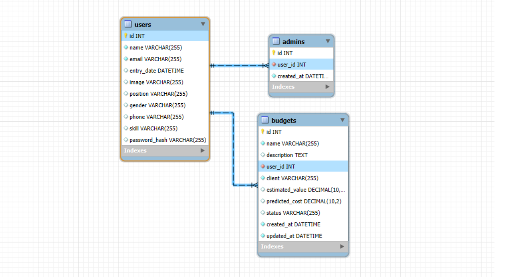

# 🧠 Zeus – Sistema Interno de Gestão da Comp Júnior

Zeus é um sistema de gestão interna desenvolvido para a Comp Júnior com o objetivo de facilitar o controle de membros, orçamentos, clientes, penalidades, equipamentos e projetos. Focado em segurança, simplicidade e desempenho, ele foi construído com tecnologias modernas e boas práticas de arquitetura e autenticação.

---

## 👥 Visão do Usuário

Como **ADMINISTRADOR**:
- Cadastrar e gerenciar os membros da empresa.
- Controlar e visualizar orçamentos dos projetos.
- Um sistema que impeça acessos não autorizados.


---

## ⚙️ Tecnologias Utilizadas

| Tecnologia | Descrição | Justificativa |
|-----------|-----------|----------------|
| **Node.js** | Ambiente de execução JavaScript | Performance assíncrona, ideal para APIs REST |
| **Express** | Framework web para Node.js | Facilita a criação de rotas e middlewares |
| **Sequelize** | ORM para Node.js | Facilita o mapeamento objeto-relacional |
| **JWT** | JSON Web Token | Autenticação segura via token |
| **bcryptjs** | Biblioteca de hash | Garante segurança das senhas |
| **MySQL** | Banco de dados relacional | Leve, popular, integração eficiente com Sequelize |

### 🗃️ Por que MySQL?

Optamos pelo **MySQL** por ser um banco de dados relacional amplamente utilizado, com **boa performance**, **fácil integração com Sequelize** e suporte robusto para **relacionamentos entre tabelas**. Também é uma solução acessível e leve para a realidade da Comp Júnior.

---

## 🧩 Funcionalidades

### 👥 Usuários

- Campos:
  - Nome, nascimento, e-mail, cargo, telefone, gênero, foto, data de ingresso, habilidades
- Edição e exclusão com confirmação
- Listagem completa de membros

### 💼 Módulo de Orçamentos

- Campos:
  - Número, nome do projeto, cliente, membro responsável, valor estimado, custo previso, status
- Data de criação gerada automaticamente
- Status: `Em análise`, `Aprovado`, `Reprovado`

### 🔐 Autenticação (USUÁRIO)

- Login com e-mail e senha

### Autenticação (ADMINISTRADOR)

- Todo o administrador é um usuário, logo ele fará o login assim como qualquer outro.
- Entretanto, toda ação que requer a permissão de um administrador é feita uma verificação se o id do usuário logado consta na **tabela Admins**, caso contrário, ele não é um administrador.

```Javascript
const verifyAdmin = await Admins.findOne({
            where: {
                user_id: req.userId
            }
        });

        if(!verifyAdmin) {
            return res.status(401).json({ message: `You don't have permission...` });
        }
```

---

## 📋 Regras de Negócio

- Apenas **administradores autenticados** podem cadastrar, editar ou excluir usuários e orçamentos.
- Todo administrador está vinculado a um usuário (`Admins.user_id → Users.id`).
- A senha de cada usuário é criptografada com bcrypt.
- Todas as exclusões exigem confirmação.
- Os campos obrigatórios são validados no back-end.
- Redirecionamentos automáticos ao finalizar ações (como cadastro de orçamento).

---

## 🧠 Diagrama 


> Imagem gerada pelo MySql workbench.
---


