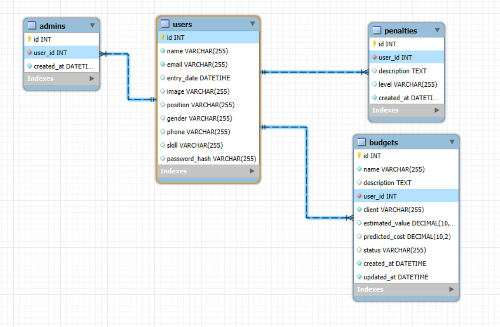
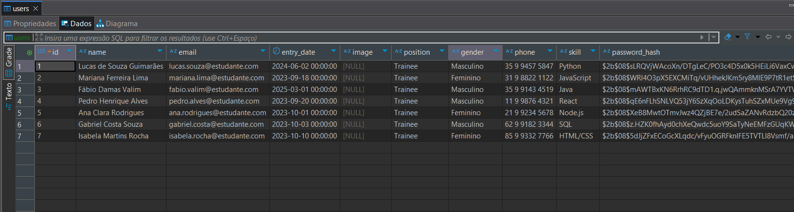
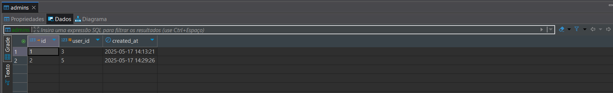
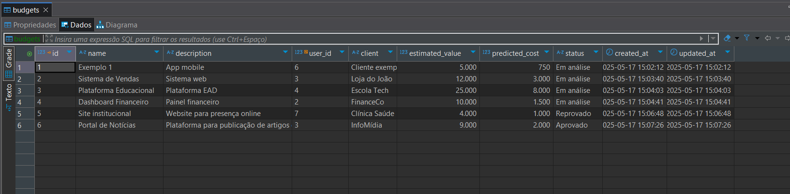
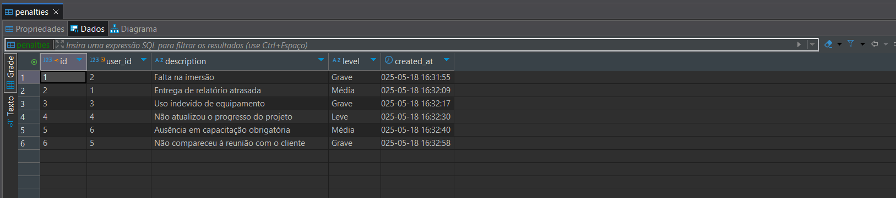
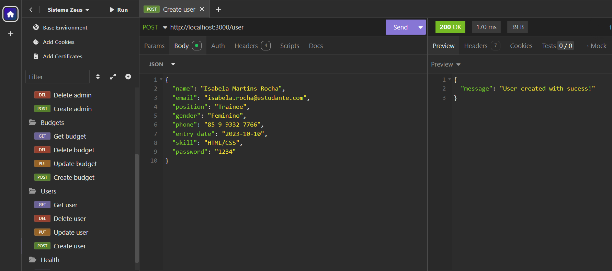

# 💡 Zeus – Sistema Interno de Gestão da Comp Júnior

Zeus é um sistema de gestão interna desenvolvido para a Comp Júnior com o objetivo de facilitar o controle de membros, orçamentos, clientes, penalidades, equipamentos e projetos. Focado em segurança, simplicidade e desempenho, ele foi construído com tecnologias modernas e boas práticas de arquitetura e autenticação.

<br>

## ⚙️ Tecnologias Utilizadas

| Tecnologia | Descrição | Justificativa |
|-----------|-----------|----------------|
| **Node.js** | Ambiente de execução para JavaScript no lado do servidor | Permite operações assíncronas e de alta performance, ideal para construção de APIs REST escaláveis |
| **Express** | Framework web para Node.js | Simplifica a criação de rotas, middlewares e gerenciamento de requisições HTTP |
| **Sequelize** | ORM (Object-Relational Mapping) para Node.js | Abstrai operações SQL, facilitando a manipulação de dados relacionais com JavaScript |
| **JWT** | JSON Web Token para autenticação baseada em token | Garante autenticação segura e sem necessidade de manter sessões no servidor |
| **bcryptjs** | Biblioteca para hash de senhas | Protege senhas sensíveis com criptografia forte antes de armazená-las no banco |
| **MySQL** | Sistema de gerenciamento de banco de dados relacional | Leve, amplamente utilizado e com excelente integração ao Sequelize, ideal para modelagem relacional |
| **Multer** | Middleware de upload de arquivos para Node.js | Permite o gerenciamento eficiente de uploads (como imagens ou documentos) |

<br>

### 🗃️ Por que MySQL?

Optamos pelo uso do **MySQL**, por ser um banco de dados relacional, é ideal para sistemas que **exigem integridade referencial**, estrutura de dados bem definida e suporte robusto a transações, como no caso de aplicações com múltiplas entidades relacionadas — por exemplo, usuários, projetos e penalidades em um sistema de gestão. Ele permite consultas complexax e **garante consistência dos dados**.<br> 
No entanto, bancos de dados não relacionais (NoSQL), como MongoDB, são mais vantajosos em cenários que demandam alta escalabilidade horizontal, manipulação de dados semi-estruturados (como JSON) e flexibilidade no schema — como em aplicações com dados altamente variáveis, grandes volumes de leitura e escrita, ou que priorizam desempenho sobre consistência estrita, como redes sociais ou sistemas de recomendação.

---

## 🚀 Como executar o projeto

### 📦 Pré-requisitos

- Antes de começar, é necessário ter instalado em sua máquina:
- Node.js
- MySQL
- Nodemon (pode ser instalado com npm i -D nodemon)
- Insomnia (opcional, usado para testes)

### 📁 Clonando o projeto

```bash
git clone https://github.com/fabiovalim/api-sistema-zeus.git

cd api-sistema-zeus
```
### 📦 Instalando as dependências

```bash
npm install
```

## ⚙️ Configuração do ambiente
- Crie um arquivo **.env** na raiz do projeto e adicione as seguintes variáveis:

```bash
# dados de exemplo - atualize com seus dados

PORT=3000  # Porta onde o servidor Node.js será executado

DIALECT=mysql   # Dialeto do banco de dados (MySQL no Sequelize)
HOST=localhost  # Endereço do host do banco de dados
DB_USERNAME=root   # Nome de usuário do banco de dados
PASSWORD=123456    # Senha do banco de dados
DATABASE=zeus      # Nome do banco de dados utilizado
DB_PORT=3306       # Porta padrão de conexão com o MySQL

# Salt hash ou string usada como base para geração de hash com bcryptjs
HASH_BCRYPT=dcee57ceb0b251443b2b1c74f9f64187   
EXPIRE_IN=1d

SECRET_CRYPTO=0018236f623c1f981361bdd28be9c729 # Chave secreta usada para operações de criptografia
```

<br>


### 🛠️ Execute as migrações do banco de dados
```bash
npx sequelize db:migrate
```
> Isso irá criar as tabelas necessárias no banco configurado no .env.

## 🔄 Rodando o servidor


```bash
npm start
```
> Esse comando executa o servidor com **nodemon**, reiniciando automaticamente ao detectar alterações nos arquivos.

<br>

## 📁 Estrutura de Pastas

```bash
API-SISTEMA-ZEUS/
├── src/
│   ├── apps/
│   │   ├── controllers/ # lógica dos controladores
│   │   ├── middlewares/ # validações e autenticações
│   │   ├── models/      # definição dos modelos de dados
│   ├── config/     # configurações gerais da aplicação
│   ├── database/   # conexão e inicialização do banco de dados
│   ├── routes/     # definição das rotas da API
│   ├── schema/     # validações (atributos obrigatórios)
│   ├── utils/      # funções utilitárias
│   └── server.js   # ponto de entrada do servidor
├── .env            # variáveis de ambiente 

```


## Diagrama ER - Relacional 


> Imagem gerada pelo MySql workbench.


<br>


## 📌 Rotas da API

### Autenticação
- `POST /auth`: Autenticação de um usuário (admin ou membro), retorna um token JWT
```json
// corpo da requisição - POST /auth

{
    "email":"admin@zeus.com",
    "password":"1234"
}
```

### Usuários

- `GET /user`: Retorna os dados do usuário autenticado.
- `PUT /user/:id`: Atualiza os dados de um usuário específico.
- `DELETE /user/:id`: Deleta um usuário pelo id.
- `POST /user`: Cria um novo usuário.

```json
// corpo da requisição - POST /user

{
	"name": "Fábio Damas Valim",
	"email": "fabio.valim@zeus.com",
	"position": "Trainee",
	"password": "1234"
}
```

### Administradores

- ``POST /admins/:id``: Promove um usuário existente a administrador.
- ``DELETE /admins/:id``: Remove os privilégios de administrador de um usuário.

### Orçamentos
- ``GET /budgets``: Lista todos os orçamentos.
- ``PUT /budgets/:id``: Atualiza um orçamento existente.
- ``DELETE /budgets/:id``: Remove um orçamento pelo id.
- ``POST /budgets``: Cria um novo orçamento.
```json
// corpo da requisição - POST /budgets

{
	"user_id": "3",
	"name": "E-commerce de Roupas",
	"description": "Loja online",
	"client": "Moda Ativa",
	"estimated_value": "15000.00",
	"predicted_cost": "5000.00",
	"status": "Aprovado"
}
```

### Penalidades

- ``GET /penalties``: Lista todas as penalidades cadastradas.
- P``UT /penalties/:id``: Atualiza uma penalidade existente.
- ``DELETE /penalties/:id``: Deleta uma penalidade pelo id.
- ``POST /penalties``: Cria uma nova penalidade.

```json
// corpo da requisição - POST /penalties

{
	"user_id": "4",
	"description": "Desrespeito às diretrizes de comunicação interna",
	"level": "Leve"
}
```

### Uploads
- ``POST /upload/:id``: Faz upload de um arquivo (ex: imagem).
Middlewares: upload.single('image')
Descrição: Usa o Multer para processar arquivos enviados via multipart/form-data, associados a um id.

### Organização por Arquivos de Rotas

- ``user.routes.js``: define rotas relacionadas a usuários

- ``admin.routes.js``: cuida da promoção e remoção de administradores

- ``budget.routes.js``: gerencia orçamentos

- ``penalty.routes.js``: trata das penalidades

- ``upload.routes.js``: gerencia o upload de arquivos

- `auth.routes.js`: trata a autenticação de um usuário

<br>

## 📌 DEMONSTRAÇÃO DAS TABELAS 

## USUÁRIO


> Dados fictícios.

- Note que a senha do usuário não é armazenada diretamente no banco de dados. Em vez disso, ela é criptografada e o hash resultante é salvo na coluna `password_hash`, garantindo maior segurança para o usuário.


## ADMINISTRADOR



- A tabela de administradores possui uma chave estrangeira `user_id` que referencia a tabela usuarios.
- Todo o administrador é um usuário, logo ele fará o login assim como qualquer outro.
- Entretanto, toda ação que requer a permissão de um administrador é feita uma verificação se o id do usuário logado consta na **tabela Admins**, caso contrário, ele não é um administrador.

```Javascript
// Verificação se consta na tabela admins

const verifyAdmin = await Admins.findOne({
            where: {
                user_id: req.userId
            }
        });

        if(!verifyAdmin) {
            return res.status(401).json({ message: `You don't have permission...` });
        }
```


<br>

## ORÇAMENTOS



- A tabela de orçamentos (budgets) possui uma chave estrangeira `user_id` que referencia a tabela usuários, isto é, um orçamento sempre será feito por um usuário.
- Atualização, exclusão e criação de um orçamento só será possível no papel de _Administrador_.
- Status: `Em análise`, `Aprovado`, `Reprovado`

<br>

## PENALIDADES



- A tabela de penalidades (penalties) possui uma chave estrangeira `user_id` que referencia a tabela usuários, isto é, uma penalidade sempre estará referenciando um usuário.
- Atualização, exclusão e criação de uma penalidade só será possível no papel de _Administrador_.
- Level: `Leve`, `Média`, `Grave`

## TESTES
Todas as rotas da API foram testadas utilizando o **Insomnia**, incluindo:

- Operações CRUD em entidades como usuários, penalidades, projetos.
- Testes de autenticação com tokens JWT válidos e inválidos.
- Respostas esperadas para casos de erro e sucesso.
- Validações de campos obrigatórios e níveis de acesso.




## 📋 Regras de Negócio

- Toda ação requer uma autenticação.
- Apenas **administradores autenticados** podem cadastrar, editar ou excluir usuários e orçamentos.
- Todo administrador está vinculado a um usuário (`Admins[user_id] → Users[id]`).
- A senha de cada usuário é criptografada com bcrypt.
- Os campos obrigatórios são validados no back-end através de **schemas**.


---

<br>


<br>

# 👤 Autor
- **Fábio Damas Valim** - www.linkedin.com/in/fabio-valim 
